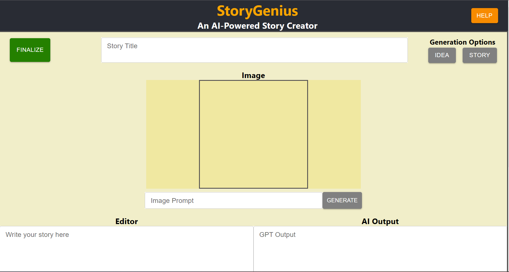

# StoryGenius
StoryGenius is a tool that helps authors craft their short stories by using the latest 
generative AI technologies. \
Created as a final project for COEN396.

## Features
* **Story Idea Generation**
    * Rapidly generate ideas for stories with visual inspiration.
* **Complete Story Generation**
    * Create an entire story using AI.
* **AI Editing**
    * Use AI to rewrite sentences or suggest edits.
* **Download to PDF**
    * Download the finished story as a PDF.

## Technologies Used
* React JS
* Node JS
* OpenAI API
    * ChatGPT
    * DALL-E 2

## How to run
### Requirements
* React and Node JS
   * Dependencies listed in `package.json`
* OpenAI API Access
* This browser extension:
   * https://chrome.google.com/webstore/detail/allow-cors-access-control/lhobafahddgcelffkeicbaginigeejlf/related?hl=en
---
1. Make sure the above requirements are met
2. Clone the repo
3. In the project directory, create a file called `.env`, and add your API key to this file as follows:
   `REACT_APP_OPENAI_API_KEY=your_api_key_here`
4. Run locally with `npm start`

## Limitations
* Application runs locally and not as a hosted website
   * Needs a valid OpenAI API key stored in a file
* Developed and tested only on Edge (Chromium), so it is not guaranteed to work with other browsers
* Requires the above browser extension to circumvent a blocked by CORS policy error for the download to PDF feature to work correctly

## Future Improvements
* Resolve the above limitations
* New Features
   * User can select the genre when generating an idea or story
   * User can add custom genres
   * Images generated by DALL-E are saved and UI provides option to switch between them
* Overhaul the co-creative editing feature
